<div align="center">
  
  <h1>ReplyOS</h1>
  <p><strong>Grounded reply drafts, right inside X (Twitter).</strong></p>
  
  <p>
    
    
    
  </p>
</div>

---

## What is ReplyOS?

Tired of reply tools that sound like generic AI? **ReplyOS** lives inside your X feed and drafts four reply angles that are tied to the actual tweet, thread context, and your saved voice profile.

No more `"Great point!"`, no more `"This resonates!"`, and no detached replies that could fit under any post. ReplyOS trims noisy context, keeps requests bounded, and repairs common AI tells before showing drafts.

## Focused Drafting UI

ReplyOS uses a restrained graphite interface so the drafts stay readable and easy to judge:
- **Quiet controls:** The injected action is simply `Draft reply`.
- **Bounded context:** Timeline noise is ignored; thread context is capped before it reaches the model.
- **Grounded cleanup:** Generic openers, leaked strategy labels, and oversized requests are handled before they hit your compose box.
- **Local settings:** API keys and voice data stay in `chrome.storage.local`.

## Supported Models

Bring your own API key for the provider you prefer:

- **Groq** — fast OpenAI-compatible generation.
- **NVIDIA NIM** — hosted OpenAI-compatible models.
- **Google Gemini** — Gemini REST API support.

The popup includes fallback model lists, so dropdowns still populate even if provider metadata is not available yet.

---

## The 4 Reply Angles

Every time you hit the **Draft reply** button beneath a tweet, ReplyOS analyzes the available context and generates four strategic angles:

1. **Contrarian** — Pushes back on the premise, cost, or incentive.
2. **Insightful** — Names the mechanism underneath the tweet.
3. **Relatable** — Captures the lived annoyance without saying "relatable."
4. **Funny** — Deadpan or lightly absurd, anchored in the tweet's detail.

---

## SOLID Architecture

ReplyOS is built using Vanilla JavaScript and Chrome Extensions Manifest V3. The codebase was meticulously refactored using **SOLID design principles**, making it incredibly easy to extend and maintain without touching a bundler:

```text
TweetBot/
├── background/                 Service worker
│   ├── providers.js            ← Configurations & constants
│   ├── storage.js              ← Chrome.storage sanitization & CRUD
│   ├── prompts.js              ← System guardrails & complex response parsing
│   ├── api.js                  ← Unified Fetch API (Groq/Nvidia/Gemini)
│   └── handlers.js             ← Message action orchestration
│
├── content/                    Content scripts loaded sequentially
│   ├── state.js                ← Shared global state 
│   ├── scraper.js              ← Reads Tweet text, Authors, and FULL ancestor thread flow
│   └── ui.js                   ← Glassmorphic Modal rendering & keyboard nav
│
├── popup/                      Extension popup
├── onboarding/                 First-time setup flow
└── manifest.json               MV3 config
```

### Key Technical Decisions
1. **No Bundlers Required**: `background.js` leverages native ES Module imports (`"type": "module"` in manifest).
2. **Sequential Content Scripts**: `content.js` features are split into multiple files loaded via the `content_scripts` array sequentially, allowing clean code separation without a bundler.
3. **Bounded Thread Context**: ReplyOS only sends parent context on real status pages and caps thread text to avoid bloated provider requests.
4. **Data Privacy First**: API keys and personas are stored entirely offline in `chrome.storage.local`.

---

## Installation & Setup

Want to run it right now? It takes 60 seconds:

1. Clone or download this repository to your local machine:
   ```bash
   git clone https://github.com/Kutral/tweetOS.git
   ```
2. Open Google Chrome (or any Chromium browser like Brave, Edge, Arc).
3. Navigate to `chrome://extensions`.
4. Toggle **"Developer mode"** ON in the top right corner.
5. Click **"Load unpacked"** and select the folder you just downloaded.
6. The onboarding flow opens automatically. Follow the steps, insert your API key, and define your voice profile.

---

## Pro-Tips / Keyboard Navigation

We built ReplyOS for power users. When the generation modal opens:
- Press `1`, `2`, `3`, or `4` to instantly select a reply strategy.
- Press `Enter` to auto-inject the reply directly into the X compose box.
- Press `Escape` to close and vanish. 

---

<div align="center">
  <i>Draft fast. Edit like yourself.</i>
</div>
